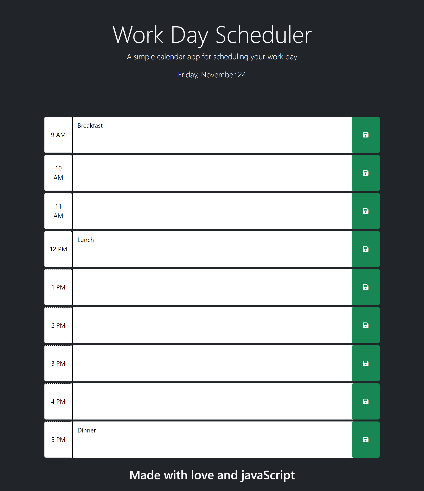

# <Your-Project-Title>

## Description

To test my newly acquired knowlegde on APIs I made a daily planner that allows you to organize your day through the regular 9AM-5PM office hours, you can save all your schedule for that day and come back to check it later whenever you need to, I really feel jQuery and bootstrap really streamlined the process of making this happen

## Usage

When you load the page you'll be provided with timeblocks where you can type your appointments for that time of the day, the save button to the right will save your entries until you modify them

